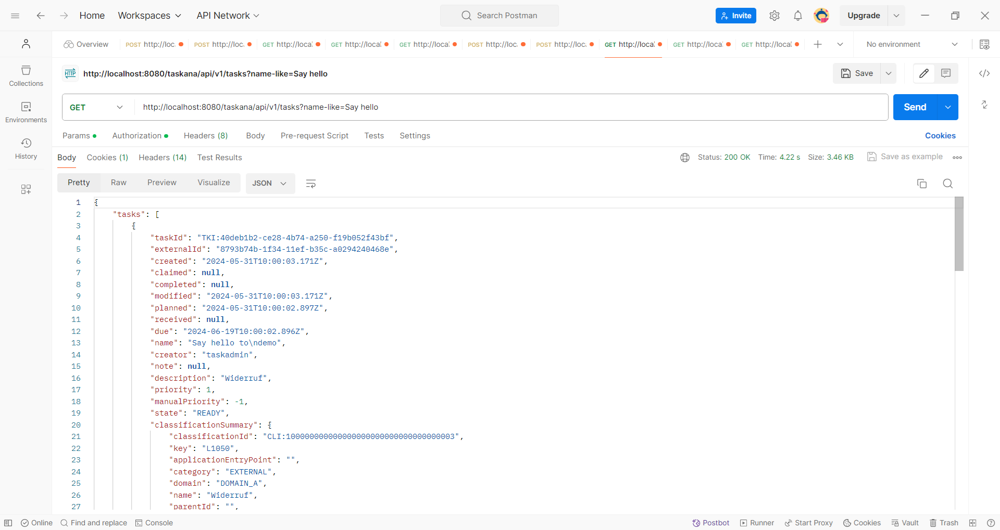

# Getting Started
In this article, the set up of the Adapter is explained step by step. Additionally, you can try out some of the functionalities of the Adapter following the instructions in this article.

## What you'll need

- an IDE of your choice (preferably IntelliJ)
- Java 17
- maven
- Camunda Modeler
- Postgres or Docker (to set up postgres database)
- optional: postman (makes REST API requests easier)
- Working KADAI application (see [here](../getting-started/exampleSpringBoot.md) for instructions)

Note: Please name your packages, folders and files exactly like in the example!

## Step 0 (optional): Initialize an empty Camunda application

If you don't have a Camunda application that you could use for experimenting with the Adapter, install a new application. You can use  https://start.camunda.com/ to initialize an empty application. You need to choose Java 17. Additionally, make sure that the modules "REST API", "Webapps" and "Spin" are chosen and set an admin username and password of your choice.


Unpack the project in a folder of your choice and open it in your IDE.

## Step 1: Configure your Camunda application

Add a new extension property to your User Tasks. The name of the property should be kadai.classification-key. It should have an existing classification key as value. If you are using the KADAI example application, you can enter "L1050" as value.

Add following dependencies to the dependencies section of your pom:

```
<dependency>
  <groupId>pro.kadai</groupId>
  <artifactId>kadai-adapter-camunda-outbox-rest-spring-boot-starter</artifactId>
  <version>3.1.0</version>
</dependency>
<dependency>
  <groupId>org.jboss.resteasy</groupId>
  <artifactId>resteasy-servlet-spring-boot-starter</artifactId>
  <version>6.1.1.Final</version>
</dependency>
<dependency>
  <groupId>org.camunda.spin</groupId>
  <artifactId>camunda-spin-dataformat-json-jackson</artifactId>
</dependency>
<dependency>
  <groupId>org.postgresql</groupId>
  <artifactId>postgresql</artifactId>
</dependency>
```
You need to exclude the following from the org.camunda.bpm.springboot dependency with the artifact ID "camunda-bpm-spring-boot-starter-rest":
```
<dependency>
  <groupId>org.camunda.bpm.springboot</groupId>
  <artifactId>camunda-bpm-spring-boot-starter-rest</artifactId>
  <exclusions>
    <exclusion>
      <groupId>org.skyscreamer</groupId>
      <artifactId>jsonassert</artifactId>
    </exclusion>
  </exclusions>
</dependency>
```
Then, add a repository to the pom:
```
<repositories>
  <repository>
    <id>jboss-public-repository</id>
    <name>JBoss Repository</name>
    <url>https://repository.jboss.org/nexus/content/groups/public</url>
  </repository>
</repositories>
```
Add the following file to your resources folder:

### kadai-outbox.properties
```
kadai.adapter.outbox.schema = kadai_tables
kadai.adapter.outbox.max.number.of.events = 57
kadai.adapter.create_outbox_schema = true
kadai.adapter.outbox.initial.number.of.task.creation.retries = 5
kadai.adapter.outbox.duration.between.task.creation.retries = PT1H

#kadai.adapter.outbox.datasource.jndi=java:jboss/datasources/ProcessEnginePostgres
#kadai.adapter.outbox.datasource.jndi=jdbc/ProcessEngine

kadai.adapter.outbox.datasource.driver=org.postgresql.Driver
kadai.adapter.outbox.datasource.url=jdbc:postgresql://localhost:5102/postgres
kadai.adapter.outbox.datasource.username=postgres
kadai.adapter.outbox.datasource.password=postgres

#kadai.adapter.outbox.datasource.url=jdbc:h2:mem:camunda;NON_KEYWORDS=KEY,VALUE;IGNORECASE=TRUE;LOCK_MODE=0;DB_CLOSE_ON_EXIT=FALSE;
#kadai.adapter.outbox.datasource.driver=org.h2.Driver
#kadai.adapter.outbox.datasource.username=sa
#kadai.adapter.outbox.datasource.password=sa
```

You need to add at least one of the following `application.properties` or `application.yaml` given below:

### application.properties
```
server.port=8085
spring.main.allow-bean-definition-overriding=true
camunda.bpm.auto-deployment-enabled=true

server.servlet.context-path=/example-context-root
camunda.bpm.admin-user.id=admin
camunda.bpm.admin-user.first-name=admin
camunda.bpm.admin-user.password=admin
camunda.bpm.admin-user.last-name=admin

camunda.bpm.database.type=postgres

# new mandatory field starting from camunda version 7.20
# see https://forum.camunda.io/t/camunda-7-20-history-time-to-live-cannot-be-null-cannot-deploy-wf-created-in-7-18/48159
camunda.bpm.generic-properties.properties.historyTimeToLive: P180D

# properties for resteasy-servlet-spring-boot-starter
# without these 2 propertiers the camunda-context is registered twice
resteasy.jaxrs.app.registration=property
resteasy.jaxrs.app.classes=pro.kadai.adapter.camunda.outbox.rest.config.OutboxRestServiceConfig

spring.datasource.url=jdbc:postgresql://localhost:5102/postgres
spring.datasource.driver-class-name = org.postgresql.Driver
spring.datasource.username = postgres
spring.datasource.password = postgres

#spring.datasource.url=jdbc:h2:mem:camunda;NON_KEYWORDS=KEY,VALUE;IGNORECASE=TRUE;DB_CLOSE_ON_EXIT=FALSE;
#spring.datasource.driverClassName=org.h2.Driver
#spring.datasource.username=sa
#spring.datasource.password=sa

```

### application.yaml
```
camunda:
  bpm:
    admin-user:
      first-name: admin
      id: admin
      last-name: admin
      password: admin
    auto-deployment-enabled: true
    database:
      type: postgres
    generic-properties:
      properties:
        historyTimeToLive: P180D
resteasy:
  jaxrs:
    app:
      classes: pro.kadai.adapter.camunda.outbox.rest.config.OutboxRestServiceConfig
      registration: property
server:
  port: 8085
  servlet:
    context-path: /example-context-root
spring:
  datasource:
    driver-class-name: org.postgresql.Driver
    password: postgres
    url: jdbc:postgresql://localhost:5102/postgres
    username: postgres
  main:
    allow-bean-definition-overriding: true
```

Start the camunda application and check if it runs correctly.
Close the camunda application after checking.

## Step 2: Initialize an empty Adapter application

Use the [Spring Initializer](https://start.spring.io/) to initialize a Spring Boot Project. Chose Java 17.


Unpack the project in a folder of your choice and open it in your IDE.

## Step 3: Configure your Adapter application

Add following dependencies to the dependencies section of your pom (if they don't already exist):

```
<dependencies>
  <dependency>
    <groupId>org.springframework.boot</groupId>
    <artifactId>spring-boot-starter-web</artifactId>
  </dependency>
  <dependency>
    <groupId>org.springframework.boot</groupId>
    <artifactId>spring-boot-configuration-processor</artifactId>
    <optional>true</optional>
  </dependency>
  <dependency>
     <groupId>pro.kadai</groupId>
    <artifactId>kadai-adapter</artifactId>
    <version>3.1.0</version>
  </dependency>
  <dependency>
    <groupId>pro.kadai</groupId>
    <artifactId>kadai-adapter-camunda-system-connector</artifactId>
    <version>3.1.0</version>
  </dependency>
  <dependency>
    <groupId>pro.kadai</groupId>
    <artifactId>kadai-adapter-kadai-connector</artifactId>
    <version>3.1.0</version>
  </dependency>
  <dependency>
    <groupId>com.ibm.db2</groupId>
    <artifactId>jcc</artifactId>
  </dependency>
  <dependency>
    <groupId>org.postgresql</groupId>
    <artifactId>postgresql</artifactId>
  </dependency>
  <dependency>
    <groupId>com.h2database</groupId>
    <artifactId>h2</artifactId>
  </dependency>
</dependencies>
```

Add the following annotations to your AdapterApplication, and import the packages correspondingly:

```
@EnableScheduling
@ComponentScan(basePackages = "pro.kadai.adapter")
@Import({AdapterConfiguration.class})
```

Add following files to your resources folder:

### application.properties
```
######################################################################################
## Adapter properties
######################################################################################
##
#logging.level.org.springframework=DEBUG
logging.level.pro.kadai=DEBUG
#logging.level.com.spring.ibatis=DEBUG
#logging.level.com.spring.ibatis.*=DEBUG
#logging.level.org.apache.ibatis=DEBUG

#logging.level.pro.kadai=info

## Set Server Port for Adapter
server.port = 8083
spring.main.allow-bean-definition-overriding=true

kadai.adapter.run-as.user=taskadmin
kadai.adapter.scheduler.run.interval.for.start.kadai.tasks.in.milliseconds=10000
kadai.adapter.scheduler.run.interval.for.complete.referenced.tasks.in.milliseconds=10000
kadai.adapter.scheduler.run.interval.for.claim.referenced.tasks.in.milliseconds=10000
kadai.adapter.scheduler.run.interval.for.cancel.claim.referenced.tasks.in.milliseconds=10000
kadai.adapter.scheduler.run.interval.for.check.finished.referenced.tasks.in.milliseconds=10000

kadai-system-connector-camunda-rest-api-user-name=admin
kadai-system-connector-camunda-rest-api-user-password=admin
kadai-system-connector-outbox-rest-api-user-name=admin
kadai-system-connector-outbox-rest-api-user-password=admin
####################################################################################
# System connector properties
####################################################################################
#
# Set URLs of Camunda REST API and associated KADAI Outbox REST API. The format is
# <camundaSystem1-RestURL> | <camundaSystem1-OutboxRestURL> , ..., <camundaSystemN-RestURL> | <camundaSystemN-OutboxRestURL>

kadai-system-connector-camundaSystemURLs=http://localhost:8085/example-context-root/engine-rest | http://localhost:8085/example-context-root/outbox-rest

####################################################################################
# Kadai-connector properties
####################################################################################
#
# Configure the datasource for Kadai DB (used by kadai-connector)
#kadai.datasource.jdbcUrl = jdbc:h2:tcp://localhost:9095/mem:kadai;NON_KEYWORDS=KEY,VALUE;IGNORECASE=TRUE;LOCK_MODE=0;
#kadai.datasource.jdbcUrl=jdbc:h2:mem:kadai;NON_KEYWORDS=KEY,VALUE;IGNORECASE=TRUE;LOCK_MODE=0;DB_CLOSE_ON_EXIT=FALSE
#kadai.datasource.driverClassName = org.h2.Driver
#kadai.datasource.username = sa
#kadai.datasource.password = sa
kadai.schemaName=kadai
#
# kadai.datasource.jdbcUrl=jdbc:db2://localhost:50050/kadai
# kadai.datasource.driverClassName=com.ibm.db2.jcc.DB2Driver
# kadai.datasource.username=db2user
# kadai.datasource.password=Db2password

kadai.datasource.jdbcUrl=jdbc:postgresql://localhost:5102/postgres
kadai.datasource.driverClassName=org.postgresql.Driver
kadai.datasource.username=postgres
kadai.datasource.password=postgres
#kadai.schemaName=kadai

kadai.adapter.mapping.default.objectreference.company=DEFAULT_COMPANY
kadai.adapter.mapping.default.objectreference.system=DEFAULT_SYSTEM
kadai.adapter.mapping.default.objectreference.system.instance=DEFAULT_SYSTEM_INSTANCE
kadai.adapter.mapping.default.objectreference.type=DEFAULT_TYPE
kadai.adapter.mapping.default.objectreference.value=DEFAULT_VALUE

```
### kadai.properties
```
kadai.roles.user=group1 | group2|teamlead-1 |teamlead-2 |user-1-1| user-1-1| user-1-2| user-2-1| user-2-2| max|elena|simone
kadai.roles.Admin=name=konrad,Organisation=novatec|admin
kadai.roles.business_admin=max|Moritz|businessadmin
kadai.roles.task_admin=peter | taskadmin
kadai.roles.monitor=john|teamlead_2 | monitor
kadai.domains=DOMAIN_A|DOMAIN_B|DOMAIN_C
kadai.classification.types=TASK|DOCUMENT
kadai.classification.categories.task=EXTERNAL| manual| autoMAtic| Process
kadai.classification.categories.document=EXTERNAL
kadai.jobs.enabled=false
```

## Step 4: Add SPIs to your Adapter application

SPIs need to be additionally specified in the Adapter application. You can read more about SPIs [here](../features/howToUseServiceProviderInterfaces.md).
The necessary SPI for the Adapter application can be build as follows: First, create a new package with the name taskrouting. Then, create a class in the package taskrouting with the name ExampleTaskRouter. It should look like this:
```
package com.example.demo.taskrouting; //or your own path depending on your packages
import pro.kadai.common.api.KadaiEngine;
import pro.kadai.spi.routing.api.TaskRoutingProvider;
import pro.kadai.task.api.models.Task;

/** This is a sample implementation of TaskRouter. */
public class ExampleTaskRouter implements TaskRoutingProvider {

  @Override
  public void initialize(KadaiEngine kadaiEngine) {
    // no-op
  }

  @Override
  public String determineWorkbasketId(Task task) {
    return "WBI:100000000000000000000000000000000001";
  }
}
```
Next, add a new folder to your resources folder and name it `META-INF`. Create a new folder named `services` in the folder `META-INF`, so that services is a subfolder of `META-INF`. Finally, create a file in the `services` folder with the name `pro.kadai.spi.routing.api.TaskRoutingProvider`. This file must contain the fully qualified classname (including the package) of the class ExampleTaskRouter, for example:
```
com.example.demo.taskrouting.ExampleTaskRouter
```
Make sure there aren't any empty lines in this file. 
The finished structure of the source folder should look like this:


## Step 5: Start all applications together

First, check if your postgres database is running. For example, start the container provided in the KADAI repository by executing `bash ./docker-databases/prepare_db.sh POSTGRES_14 && exit` in a terminal. 

Then, start your KADAI application. Start your camunda app next, and login. Last, start the adapter. 

## Step 6: Try out different functionalities of Adapter. 

1. Start a process with a User Task in Camunda. The User Task should be imported to KADAI automatically. You can check it by first knowing the name of the user task from the started process, then make a postgres GET request to KADAI using the following request, entering the name (or just substring of the name) of the user task for the "name-like" attribute
   ```
   GET http://localhost:8080/kadai/api/v1/tasks?name-like=Say hello
   ```
   Here we assume that the name of the user task is "Say hello to demo", but you can set the name differently by opening the `process.bpmn` file in the camunda application and set the name attribute in `<bpmn:userTask>`differently.
   Make sure that the correct port number is used for KADAI request. You can check the port number in `application.properties` of KADAI under `server.port`. If not specified, then the default port is 8080. You have to authenticate yourself using Basic Auth: In postman, go to the "Authorization" tab. There, select basicAuth and type "admin" as user and "admin" as password. Make sure enableCsrf is set to false in the properties of the KADAI application.
   
   The output of the request in Postman should look like this:

   

2. Claim the KADAI Task from the previous step using postman. Make sure you add the following property to the `application.properties` file of the adapter application: ``kadai.adapter.camunda.claiming.enabled=true``, then restart the adapter. To send the POST request, use the same authorization as in the previous step. The Task should get claimed in Camunda automatically.
   ```
   POST http://localhost:8080/kadai/api/v1/tasks/{taskid}/claim
   ```
   You can check that the task in KADAI is also claimed by making the same GET Request as in Step 1 and see the `claimed` attribute.

3. Complete the KADAI Task from previous step using postman. To send the POST request, use the same authorization as in the previous step. The Task should disappear from Camunda Tasklist.
   ```
   POST http://localhost:8080/kadai/api/v1/tasks/{taskid}/complete
   ```


More functionalities like the cancelling of a claimed task and their URLs can be found in the [full documentation of the REST-API](https://kadai.azurewebsites.net/kadai/docs/rest/rest-api.html).